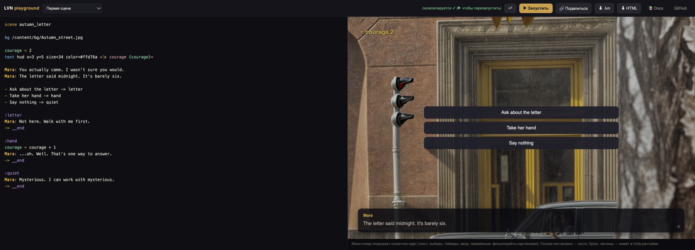

# Elvin — narrative games for Unity, written as plain text

[](https://github.com/fomeanator/unity-lvn-vn-engine/actions/workflows/ci.yml)
[](LICENSE)

**You write a story. Elvin plays it as a game.** No dialogue system to build,
no branching engine, no save system — that *is* the engine.

[](https://fomeanator.github.io/unity-lvn-vn-engine/)

The screenshot is the whole pipeline. Here is its entire source — this is
**Elvin Script**, and yes, it really is the full game on the right:

```lvns
scene autumn_letter

bg /content/bg/Autumn_street.jpg

courage = 2
text hud x=3 y=5 size=34 color=#ffd76a «✨ courage {courage}»

Mara: You actually came. I wasn't sure you would.
Mara: The letter said midnight. It's barely six.

- Ask about the letter -> letter
- Take her hand -> hand
- Say nothing -> quiet

:hand
courage = courage + 1
Mara: ...oh. Well. That's one way to answer.
-> __end
```

Dialogue, characters with emotions, branching with conditions and costs,
variables and expressions, a reactive HUD, staging (backgrounds, fades,
camera, particles, audio), script-driven animation, save/load, timed choices,
text input, voice-over, **localization** — all from text a writer (or an AI)
can author.

> 🎮 **Try it in 10 seconds — no install:**
> **[the browser playground](https://fomeanator.github.io/unity-lvn-vn-engine/)** —
> write on the left, play on the right, share by link, export a single HTML file.
>
> 📚 **Docs:** the whole `howto/` + `docs/` as a searchable site —
> **[fomeanator.github.io/unity-lvn-vn-engine/docs](https://fomeanator.github.io/unity-lvn-vn-engine/docs/)**.

## Who it's for

- **Programmers** — stop rebuilding the visual-novel / dialogue / branching /
  stats / save stack for every project. Drop Elvin in, feed it a script, ship.
  The whole game is **data**, not code.
- **Writers & designers** — author the entire game in readable text (it looks
  like a screenplay with choices) and watch it run as a real game, no engineer
  in the loop.
- **AI-first teams** — the language is simple and unambiguous enough that an
  **LLM writes an entire game in one go**. Point your agent at
  [`llms.txt`](llms.txt), or plug the toolchain straight in via the
  **[MCP server](docs/mcp.md)** (`lvns_check` / `lvns_convert` / `lvn_doc`).
  Onboarding: [`howto/AGENTS.md`](howto/AGENTS.md).

> The name: **Elvin** is just how you say **LVN** — the `.lvn` format it
> plays. You write **Elvin Script** (`.lvns`); it compiles to the `.lvn`
> container; the Unity runtime plays it.

---

## What you can build

Anything driven by **choices + state**. Each genre ships with a working,
validated example under [`howto/`](howto/):

| | | | |
|---|---|---|---|
| 📖 Visual novel | 🎬 Kinetic novel | 🗺 Gamebook / CYOA | 🖱 Point-and-click |
| ⚔ RPG | 🍪 Clicker / idle | 💕 Dating sim | ❓ Quiz |
| 🔍 Detective | 🏪 Tycoon | 🗡 Roguelike | 🧩 Puzzle |

It is **not** a real-time/physics engine — time is measured in turns, input is
choices and clicks. The exact, code-verified list of what it can and can't do
is [`howto/CAPABILITIES.md`](howto/CAPABILITIES.md).

---

## Quickstart

### In Unity (the common path)

1. **Package Manager → Add package from git URL:**
   ```
   https://github.com/fomeanator/lvn-engine.git
   ```
2. Drop a `.lvns` file into `Assets/` — Unity compiles it automatically
   (a ScriptedImporter; no external tool, no terminal).
3. Put a **`VnStage`** on a GameObject with a `UIDocument`, point it at the
   compiled asset, press **Play**. Background, characters, typewriter
   dialogue, branching choices, the HUD, animation — running.

Building a stand-alone novel **app** instead of embedding? Add
[`lvn-engine-shell`](https://github.com/fomeanator/lvn-engine-shell)
(boot → title browse → store/wardrobe/gallery/profile screens) and use
`NovelApp` — you write content, not UI code. Details:
[`unity/Packages/com.lvn.engine/README.md`](unity/Packages/com.lvn.engine/README.md).

### From the command line (CI / Ink / articy)

```sh
cd tools/lvnconv
go run . convert  -i ../../examples/hello.lvns -o /tmp/hello.lvn   # Elvin Script → .lvn
go run . convert  -i ../../examples/hello.ink  -o /tmp/hello.lvn   # Ink → .lvn
go run . validate /tmp/hello.lvn   # dangling jumps, unknown ops, dup labels
go run . locale   -lang en /tmp/hello.lvn   # translation catalog, gettext-style
```

Aim for `OK … 0 warning(s)` — the build-correctness gate needs no engine.

### Serve content (optional)

```sh
go run ./server -content ./server/content -addr :8077
```

Live content updates, player saves, the docs site — and **`/play/`**, the
playground from the screenshot, running on your own content. The game itself
plays equally well fully offline.

---

## What's in the box

- **Elvin Script (`.lvns`)** — a tiny authoring language: dialogue with
  emotions, choices (with conditions/costs/timeouts), variables and an
  expression engine (~25 built-ins), `if`/`for`/`while`/functions, a reactive
  HUD, full staging, script-driven animation, save/load, text input,
  voice-over, translation catalogs.
- **Unity runtime** ([`lvn-engine`](https://github.com/fomeanator/lvn-engine))
  — plays a game from the script with no per-game code: a parametric **cast**
  (a character is layers × named axes, so *K poses + M emotions = K+M images,
  not K×M*), bones + spring physics, placement & clickable hotspots, effects,
  save/load with migration.
- **First-party packages**, each optional, each its own repo:
  [`lvn-engine-shell`](https://github.com/fomeanator/lvn-engine-shell) (the
  ready novel app),
  [`lvn-engine-services`](https://github.com/fomeanator/lvn-engine-services)
  (offline-first wallet/IAP/ads/analytics/leaderboards),
  [`lvn-engine-spine`](https://github.com/fomeanator/lvn-engine-spine)
  (Spine skeletons),
  [`lvn-engine-addressables`](https://github.com/fomeanator/lvn-engine-addressables)
  (bundle loading).
- **`lvnconv`** — a standalone transcoder (Go CLI + WASM) that also imports
  **Ink** and **articy:draft** (XML export *and* the binary `.adpd` project)
  into the same `.lvn`; plus `validate`, `probe`, `locale`.
- **Content server** (Go, optional) — manifest/scripts/assets, live updates,
  player saves, the docs site, one-click APK export.
- **Web panel** (optional) — a visual cast editor and in-browser script IDE.

Under the hood, `.lvn` is a neutral container any authoring tool can target
and any runtime can play — producers and players evolve independently. (If
you know media codecs: it's the container, and `lvnconv` is the transcoder.)

---

## Extending it

Custom game logic lives in **plugins**, not forks: register an op from C#
(`LvnOps.Register`) and author it from the script as `ext my_op …` — with
flow control (pause the story for a mini-game, resume, jump). Declare your
ops in an [`ext-grammar.json`](docs/embedding.md) and the validator and the
IDE treat them like built-ins. The complete plugin anatomy ships as a sample
(`Samples~/ExtensionPlugin`), and the Spine package is the first-party proof.
Embedding levels (`LvnPlayer` + your stage / `VnStage` / `NovelApp`):
[`docs/embedding.md`](docs/embedding.md).

## Design rules

- **Unknown is an error, never a silent skip.** Content bugs surface at
  compile time, not in a player's hands.
- **Stable ids.** Labels, choices and endings survive reimports — saves,
  analytics and translations stay valid across content edits.
- **Offline-first.** The game and its assets play without a network.
- **The whole game is data.** The engine hardcodes no scene — swap the
  content, keep the engine.

## Repository layout

| Path | What |
|---|---|
| `howto/` | **Build-a-game kit + AI-agent onboarding**: language reference, capabilities, cheatsheet, recipes, 12 genre guides with validated examples. Start at `howto/AGENTS.md`. |
| `tools/lvnconv/` | The transcoder CLI (Go): `convert` / `validate` / `probe` / `locale`, WASM build, articy/Ink importers. |
| `tools/lvn-lang/` | Language tooling for `.lvns` (grammar + static analysis). |
| `docs/` | Format & system specs: `lvn-format.md`, `staging-tags.md`, `cast.md`, `placement.md`, `animation-system.md`, `embedding.md`, `releasing.md`. |
| `server/` | Go backend: content manifest, assets + admin upload, player state, docs website, APK export. |
| `panel/` | Web authoring panel / IDE (visual cast editor, in-browser compile). |
| `unity/Packages/` | The Unity packages (development home; consumers install the [mirror repos](docs/releasing.md)). |
| `examples/` | Minimal scripts in Ink, Elvin Script, and compiled `.lvn`. |

## Status

`v0.9` — a full, working narrative-game engine for Unity: the language and
container spec, the runtime with cast/physics/Spine/drag-and-drop, CG gallery
and read-tracking, save/load with thumbnails and migration, localization with
live language switching, the transcoder with Ink/articy front-ends and an MCP
server, the web IDE + playground, and a release pipeline that ships a
playable APK from every tag. Extension seams are under a
[compatibility contract](docs/releasing.md).

See the package [CHANGELOG](unity/Packages/com.lvn.engine/CHANGELOG.md) for
the full story.

## License

MIT — see [LICENSE](LICENSE).
